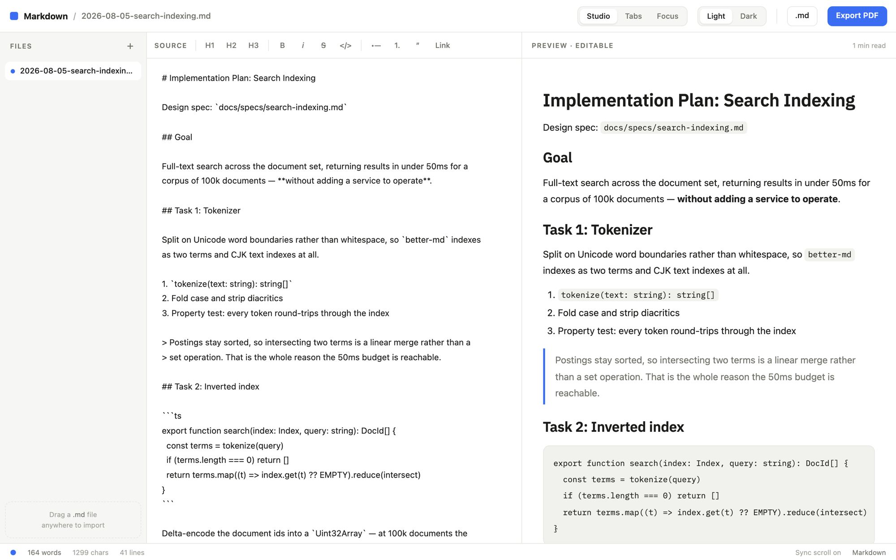

<h1 align="center">better-md</h1>

<p align="center">
  Open your Markdown files in a real editor, straight from the terminal.
</p>

<p align="center">
  <a href="https://github.com/Sachchaa/better-md/releases"></a>
  <a href="https://github.com/Sachchaa/better-md/actions/workflows/ci.yml"></a>
  <a href="LICENSE"></a>
</p>

<p align="center">
  <a href="https://better-md.dev">Website</a> &nbsp;•&nbsp;
  <a href="https://playground.better-md.dev">Playground</a> &nbsp;•&nbsp;
  <a href="#install">Install</a> &nbsp;•&nbsp;
  <a href="#how-it-works">How it works</a>
</p>

<p align="center">
  <picture>
    <source media="(prefers-color-scheme: dark)" srcset="public/site/screenshot-dark.png">
    
  </picture>
</p>

```sh
curl -fsSL https://better-md.dev/install.sh | sh
```

## Why

Coding agents write a lot of Markdown — plans, specs, notes — and reading those in a
terminal pager or a raw text buffer wastes what they are. Browsers render Markdown
beautifully but cannot open files from your disk. better-md closes that gap.

- **One command, any file.** `better-md --plan` opens your newest Claude Code plan. Point
  it at a file or a directory instead and it opens that.
- **Two-way editing.** Edit the Markdown source or the rendered preview — both stay in
  sync. `Cmd/Ctrl+S` writes back to the real file.
- **Keeps up with your agent.** The workspace is watched, so a plan updates on screen
  while it is still being rewritten. Unsaved edits are never silently overwritten.
- **Local only.** No account, no sync service, nothing leaves your machine.
- **No Node.js required.** The runtime and the editor are both embedded in one binary.

Try the editor at **[playground.better-md.dev](https://playground.better-md.dev)** — it runs
with sample documents, since opening your own files is exactly the part that needs the
local command.

## Install

```sh
curl -fsSL https://better-md.dev/install.sh | sh
```

Prebuilt for macOS and Linux, on arm64 and x64. The installer picks the right build,
verifies it against the published `SHA256SUMS` — refusing to install if that does not
match, or if the checksums are missing — and drops it in `~/.local/bin` as `better-md`,
plus `btr-md` as a shorter alias.

```sh
BETTER_MD_VERSION=v0.1.0 sh install.sh   # pin a release
BETTER_MD_INSTALL=/usr/local/bin sh …    # choose the directory
```

Rather read it first? It is served as plain text, so <https://better-md.dev/install.sh>
opens in a browser, and the
[copy on GitHub](https://raw.githubusercontent.com/Sachchaa/better-md/main/install.sh) is
identical. To uninstall, delete the two files it reports — there is nothing else on disk.

## Usage

```sh
better-md --plan          # Claude Code's plans (~/.claude/plans), newest active
better-md notes.md        # a single file
better-md ./docs          # every Markdown file in a directory
better-md --port 4321     # a fixed port instead of an ephemeral one
better-md --no-open       # print the URL without launching a browser
```

`btr-md` is the same binary under a shorter name, and each name reports itself in `--help`
and in error messages.

Edits save with `Cmd/Ctrl+S`. Nothing is written until you press it — auto-save would
rewrite plan files on every stray keystroke.

## How it works

Browsers cannot open arbitrary files from disk. The CLI closes that gap by becoming a small
local server the editor talks to.

```
better-md --plan
   │
   ├─ resolve one directory as the workspace          cli/resolve.ts
   ├─ start http://127.0.0.1:<ephemeral port>         cli/server.ts
   │    ├─ serve the editor from assets embedded in the binary
   │    ├─ GET/PUT /api/doc     documents, via the confinement gateway
   │    └─ GET     /api/events  change notifications (SSE)
   ├─ watch the workspace, debounced 50ms             cli/watch.ts
   └─ open your browser at  .../?t=<token>
```

Everything is scoped to that one directory, and a fresh 32-byte token is minted per run and
never persisted. The launch URL carries `?t=<token>`; the app reads it, then strips it from
the address bar so it never lands in your history. With a token it reads and writes real
files; without one — a bookmark, a retyped URL, a second tab — you get the plain browser
editor with sample documents, never a broken page.

**When the file changes underneath you.** Each save carries the modification time the
document was loaded at. If disk moved since, the write is refused and you choose: keep
yours, or take the version on disk. If the file was _deleted_ rather than changed, there is
no version to take, so your buffer is kept — it is now the only copy. Changes arriving
while you have no unsaved edits just refresh silently.

[better-md.dev](https://better-md.dev) walks through the same flow in more detail.

## Security

The CLI runs a short-lived HTTP server on `127.0.0.1`. Because any page in your browser can
reach a localhost port, three independent layers guard the file API:

1. **Bearer token** — a fresh 32-byte token per run, required on every `/api/*` request and
   compared in constant time. It is sent as a header, which a cross-site form or image
   request cannot forge.
2. **Origin validation** — requests carrying a foreign `Origin` are refused.
3. **Path confinement** — only `.md`, `.markdown` and `.txt` files resolving inside the
   workspace root are readable or writable, symlinks included.

The editor's own assets are embedded in the binary, so serving them involves no path
resolution and no filesystem access — that route cannot be walked out of.

**Known limitation:** confinement is path-based, so a **hardlink** inside the workspace
pointing at a file outside it is not detected. Unlike a symlink it resolves to a distinct
inode with no path to inspect, and writes go straight through to the linked-to file.

Separately, user Markdown is rendered into the editable preview via `innerHTML` and can be
imported from arbitrary `.md` files by drag-and-drop, so `src/lib/markdown.ts` escapes all
interpolated text and attributes and blocks `javascript:`, `vbscript:` and non-image
`data:` URLs. See `markdown.test.ts` for the XSS cases.

## Not supported yet

The Markdown renderer covers headings, emphasis, inline and fenced code, links, images,
blockquotes, horizontal rules, and ordered and unordered lists. It does **not** yet render
**tables** or **task lists** (`- [x]`) — both appear as literal text. Worth knowing, since
agent-written plans use them often.

## Development

```sh
pnpm install
pnpm dev            # dev server
pnpm build          # typecheck + production build into dist/
pnpm build:cli      # embed dist/ into the CLI and compile it to dist-cli/
pnpm binaries       # single-file executables into release/ (--all for every platform)

pnpm test           # unit tests (Vitest)
pnpm test:e2e       # Playwright — needs pnpm build && pnpm build:cli first
pnpm lint
pnpm format
```

Running from a checkout instead of an install:

```sh
pnpm build && pnpm build:cli
node dist-cli/index.js notes.md
```

### Deployment

One Vercel project serves the site, the hosted editor, and the installer out of a single
`dist/`, routed by hostname in `vercel.json`:

| URL                            | Serves                       | From                   |
| ------------------------------ | ---------------------------- | ---------------------- |
| `www.better-md.dev`            | the landing page             | `dist/site/index.html` |
| `playground.better-md.dev`     | the editor, sample docs      | `dist/app/index.html`  |
| `www.better-md.dev/install.sh` | the installer, as plain text | `dist/install.sh`      |

`www` is the primary domain — the apex 308-redirects to it — so `better-md.dev/install.sh`
still resolves, since `curl -L` follows the redirect.

Nothing is built to the root of `dist/`, which is what lets those host rules apply at all —
`scripts/layout-dist.mjs` explains why, and `e2e/site.spec.ts` enforces it. One local
consequence: `pnpm preview` serves `dist/` without Vercel's routing, so `/` 404s. Use
`/site/` and `/app/` instead.

## License

[MIT](LICENSE) © Sachin Kanishka
